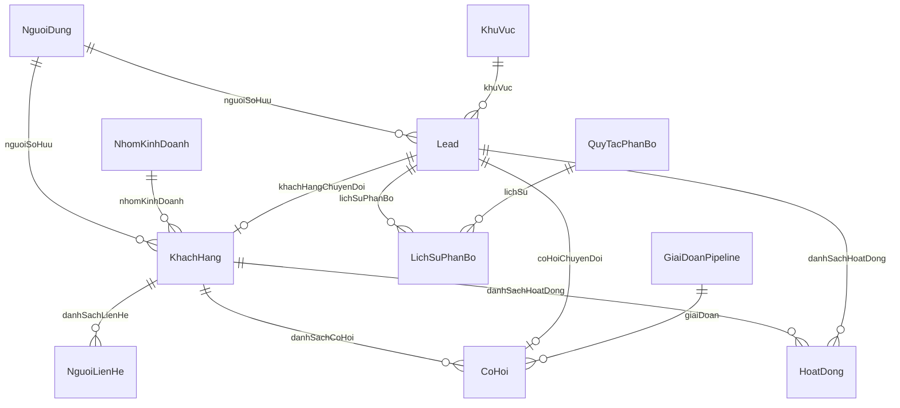

# Kế Hoạch Triển Khai SPRINT 2: CUSTOMER + CONTACT + LEAD + LEAD ASSIGNMENT

Tài liệu này xác định chi tiết kế hoạch kiến trúc, cơ sở dữ liệu, backend, API contract, frontend, kiểm thử và regression cho **Sprint 2** (EP-03: Khách hàng & Người liên hệ - 28 pts và EP-04: Lead & Phân bổ - 40 pts, Tổng: 68 pts Must).

---

## 1. User Review Required

> [!IMPORTANT]
> - **Kế thừa Foundation Sprint 1:** Giữ nguyên toàn bộ cấu trúc DB và code của Sprint 1 (RBAC, Tổ chức/Nhóm, Người dùng, Danh mục, Sản phẩm, Pipeline Stage, Audit Log, DataScopeService). Không viết lại, không tạo schema song song.
> - **Lead Conversion Transaction:** Quá trình chuyển đổi Lead sang Customer + Contact + Minimal Opportunity được bọc trong một Prisma Interactive Transaction (`prisma.$transaction`). Nếu bất kỳ bước nào lỗi (ví dụ tạo Opportunity lỗi), toàn bộ giao dịch sẽ rollback, đảm bảo tính toàn vẹn dữ liệu tuyệt đối.
> - **Phạm vi Opportunity trong Sprint 2:** Chỉ tạo model và API tối thiểu cho `CoHoi` để phục vụ chuyển đổi Lead và hiển thị thống kê Customer 360. Tuyệt đối không xây dựng Kanban kéo thả, dự báo doanh thu, hay quản lý đối thủ nâng cao (thuộc Sprint 3).
> - **Background SLA & Assignment:** Sử dụng cơ chế task/service định kỳ gọn nhẹ chuẩn NestJS (`@nestjs/schedule` hoặc recurring background check) mà không ép đưa Redis/RabbitMQ vào stack, đảm bảo độ ổn định và dễ vận hành trên Windows local.

---

## 2. Open Questions
*Hiện tại không còn câu hỏi chặn (blocker). Các business rules đều đã được chỉ rõ trong yêu cầu: Customer MST unique, Contact có vai trò quyết định và đầu mối chính, Merge chỉ dành cho Team Lead trở lên, Scoring engine tách rời cấu hình động, Assignment theo thứ tự ưu tiên (Region -> Industry -> Round Robin) hoặc chuyển vào Queue, SLA tính theo server time.*

---

## 3. Kiến Trúc Cơ Sở Dữ Liệu (Database Schema Expansion)

Mở rộng `backend/prisma/schema.prisma` với 7 bảng mới và quan hệ chuẩn xác:

### Các bảng dữ liệu mới:
1. **`khach_hang`** (`KhachHang`):
   - `id`: UUID (PK)
   - `maKhachHang`: String (Unique, format `KH-xxxxx`)
   - `tenCongTy`: String
   - `maSoThue`: String? (Unique nếu có)
   - `nganhNghe`: String?
   - `quyMo`: String?
   - `website`: String?
   - `diaChi`: String?
   - `tinhThanh`: String?
   - `nguoiSoHuuId`: String (FK `nguoi_dung`)
   - `nhomKinhDoanhId`: String? (FK `nhom_kinh_doanh`)
   - `trangThai`: Enum `TrangThaiKhachHang` (`TIEM_NANG`, `DANG_GIAO_DICH`, `KHACH_HANG`, `NGUNG_HOP_TAC`)
   - `moTa`: String?
   - `daGopVaoId`: String? (ID khách hàng chính nếu bị gộp)
   - `createdAt`, `updatedAt`
   - Indexes: `ma_so_thue`, `nguoi_so_huu_id`, `trang_thai`, `ten_cong_ty`.

2. **`nguoi_lien_he`** (`NguoiLienHe`):
   - `id`: UUID (PK)
   - `khachHangId`: String (FK `khach_hang`)
   - `hoTen`: String
   - `chucDanh`: String?
   - `email`: String?
   - `soDienThoai`: String?
   - `vaiTroQuyetDinh`: Enum `VaiTroQuyetDinh` (`NGUOI_QUYET_DINH`, `NGUOI_ANH_HUONG`, `NGUOI_DUNG_CUOI`, `NGUOI_CAN_TRO`)
   - `laDauMoiChinh`: Boolean (default `false`)
   - `ghiChu`: String?
   - `createdAt`, `updatedAt`
   - Indexes: `khach_hang_id`, `email`, `so_dien_thoai`.

3. **`lead`** (`Lead`):
   - `id`: UUID (PK)
   - `maLead`: String (Unique, format `LEAD-xxxxx`)
   - `hoTen`: String
   - `email`: String?
   - `soDienThoai`: String?
   - `congTy`: String?
   - `chucDanh`: String?
   - `nhuCauQuanTam`: String?
   - `nguonLead`: String (REQUIRED, e.g. `WEBSITE`, `EXCEL_IMPORT`, `EVENT`, `HOTLINE`, v.v.)
   - `nganhNghe`: String?
   - `quyMo`: String?
   - `khuVucId`: String? (FK `khu_vuc`)
   - `nguoiSoHuuId`: String? (FK `nguoi_dung` - null = Unassigned Queue)
   - `nhomKinhDoanhId`: String? (FK `nhom_kinh_doanh`)
   - `trangThai`: Enum `TrangThaiLead` (`MOI`, `CHO_TIEP_NHAN`, `DANG_CHAM_SOC`, `TU_CHOI`, `DA_CHUYEN_DOI`, `KHONG_TIEM_NANG`)
   - `phanLoai`: Enum `PhanLoaiLead` (`NONG`, `AM`, `LANH`) - Mặc định: `LANH`
   - `diemTiemNang`: Int (Mặc định `0`)
   - `lyDoTuChoi`: String?
   - `khachHangGoiYId`: String? (FK gợi ý khách hàng trùng lặp nếu có)
   - `khachHangChuyenDoiId`: String? (FK `khach_hang` sau khi convert)
   - `coHoiChuyenDoiId`: String? (FK `co_hoi` sau khi convert)
   - `assignedAt`: DateTime?
   - `acceptedAt`: DateTime?
   - `rejectedAt`: DateTime?
   - `firstContactAt`: DateTime?
   - `slaDeadline`: DateTime?
   - `quaHanSla`: Boolean (default `false`)
   - `createdAt`, `updatedAt`
   - Indexes: `email`, `so_dien_thoai`, `nguoi_so_huu_id`, `trang_thai`, `phan_loai`, `created_at`.

4. **`quy_tac_cham_diem`** (`QuyTacChamDiem`):
   - Cấu hình điểm cho từng tiêu chí: Ngành nghề, Quy mô, Nguồn, Mức độ quan tâm, v.v.
   - `tieuChi`: Enum/String, `toanTu`: `EQUALS` | `CONTAINS`, `giaTri`: String, `diem`: Int, `kichHoat`: Boolean.

5. **`cau_hinh_cham_diem`** (`CauHinhChamDiem`):
   - Ngưỡng phân loại: `nguongNong` (mặc định: 50), `nguongAm` (mặc định: 25), `thoiGianSlaGio` (mặc định: 24h).

6. **`quy_tac_phan_bo`** (`QuyTacPhanBo`):
   - `thuTuUuTien`: Int (1, 2, 3...) - First match wins
   - `loaiQuyTac`: `KHU_VUC` | `NGANH_NGHE` | `ROUND_ROBIN`
   - `dieuKien`: Json (`{ khuVucId: "...", nganhNghe: "..." }`)
   - `nguoiNhanId`: String? (chỉ định Sales cụ thể)
   - `danhSachNguoiDungIds`: Json? (danh sách Sales cho Round Robin)
   - `chiSoHienTai`: Int (con trỏ xoay vòng round-robin)
   - `kichHoat`: Boolean

7. **`lich_su_phan_bo`** (`LichSuPhanBo`):
   - Lưu vết mỗi lần Lead được phân bổ tự động hoặc chuyển thủ công.

8. **`co_hoi`** (`CoHoi` - Minimal Integration cho Sprint 2):
   - `id`: UUID, `maCoHoi`: String (Unique), `tenCoHoi`: String, `khachHangId`: String (FK), `leadId`: String? (FK), `giaiDoanId`: String (FK `giai_doan_pipeline`), `giaTriDuKien`: Decimal, `nguoiSoHuuId`: String (FK `nguoi_dung`), `trangThai`: `DANG_XU_LY` | `DONG_THANG` | `DONG_THUA`.

9. **`hoat_dong`** (`HoatDong` - Timeline chung):
   - Lưu vết tương tác: Gọi điện, Gặp mặt, Ghi chú, Chuyển đổi Lead, Gộp khách hàng.
   - Phục vụ Customer 360 Timeline (< 1.5s load cho 500 records nhờ pagination & index).

10. **`web_form_embed`** (`WebFormEmbed`):
    - Cấu hình form nhúng Website, token nhận submit, nguồn mặc định, rate limiting.

---

## 4. Proposed Changes

### Backend Components

#### [MODIFY] [backend/prisma/schema.prisma](file:///d:/Projects/Customer%20and%20Sales%20Opportunity%20Management%20System%20%28CRM%29/backend/prisma/schema.prisma)
- Bổ sung các enums: `TrangThaiKhachHang`, `VaiTroQuyetDinh`, `TrangThaiLead`, `PhanLoaiLead`, `LoaiPhanBo`, `TrangThaiCoHoi`.
- Thêm các models: `KhachHang`, `NguoiLienHe`, `Lead`, `QuyTacChamDiem`, `CauHinhChamDiem`, `QuyTacPhanBo`, `LichSuPhanBo`, `CoHoi`, `HoatDong`, `WebFormEmbed`.
- Mở rộng quan hệ trên `NguoiDung`, `KhuVuc`, `NhomKinhDoanh`, `GiaiDoanPipeline`.

#### [MODIFY] [backend/prisma/seed.ts](file:///d:/Projects/Customer%20and%20Sales%20Opportunity%20Management%20System%20%28CRM%29/backend/prisma/seed.ts)
- Bổ sung seed dữ liệu chuẩn:
  - Khách hàng mẫu thuộc Sales A, Sales B, Team Lead.
  - Người liên hệ mẫu (có Đầu mối chính, người quyết định, người dùng cuối).
  - Cấu hình quy tắc chấm điểm (Scoring rules: Công nghệ +20, Quy mô > 100 +15, Nguồn Website +15...).
  - Cấu hình phân bổ (Assignment rules: Phân bổ theo Khu vực Miền Bắc -> Sales A, Round Robin -> Sales Team).
  - Lead mẫu các trạng thái: Mới, Đang chăm sóc, Quá hạn SLA, và Lead đủ điều kiện chuyển đổi.

#### [NEW] `backend/src/modules/khach-hang/`
- `khach-hang.module.ts`
- `khach-hang.controller.ts`:
  - `GET /api/khach-hang`: Tìm kiếm, lọc (trạng thái, ngành nghề, quy mô, người sở hữu), phân trang, áp dụng DataScope.
  - `GET /api/khach-hang/:id`: Chi tiết khách hàng (kiểm tra quyền DataScope).
  - `POST /api/khach-hang`: Tạo mới khách hàng, kiểm tra MST trùng -> 409 Conflict.
  - `PUT /api/khach-hang/:id`: Cập nhật khách hàng (chỉ chủ sở hữu hoặc quản lý).
  - `DELETE /api/khach-hang/:id`: Xóa mềm / kiểm tra ràng buộc.
  - `GET /api/khach-hang/:id/360`: Customer 360 Aggregation (Thông tin + Contacts + Opportunities + Timeline phân trang + Tổng giá trị đã ký/đang mở) - query tối ưu hóa < 1.5s.
  - `GET /api/khach-hang/duplicates/detect`: Phát hiện khách hàng trùng lặp theo MST, tên công ty, website.
  - `POST /api/khach-hang/merge`: Gộp 2 khách hàng (yêu cầu quyền Team Lead trở lên), chuyển toàn bộ Contacts, Opportunities, Activities sang Master, đánh dấu khách hàng phụ `daGopVaoId`, ghi Audit log.
- `khach-hang.service.ts`
- `dto/create-khach-hang.dto.ts`, `dto/update-khach-hang.dto.ts`, `dto/merge-khach-hang.dto.ts`, `dto/filter-khach-hang.dto.ts`

#### [NEW] `backend/src/modules/nguoi-lien-he/`
- `nguoi-lien-he.module.ts`
- `nguoi-lien-he.controller.ts`:
  - `GET /api/khach-hang/:khachHangId/nguoi-lien-he`: Danh sách liên hệ của khách hàng.
  - `POST /api/khach-hang/:khachHangId/nguoi-lien-he`: Thêm người liên hệ (hỗ trợ đặt `laDauMoiChinh`).
  - `PUT /api/nguoi-lien-he/:id`: Sửa thông tin người liên hệ.
  - `DELETE /api/nguoi-lien-he/:id`: Xóa người liên hệ.
  - `POST /api/nguoi-lien-he/:id/reassign`: Chuyển người liên hệ sang khách hàng khác, bảo toàn lịch sử hoạt động.
- `nguoi-lien-he.service.ts`

#### [NEW] `backend/src/modules/lead/`
- `lead.module.ts`
- `lead.controller.ts`:
  - `GET /api/lead`: Tìm kiếm, lọc (trạng thái, nguồn, phân loại nóng/ấm/lạnh, người sở hữu, quá hạn SLA, date range), phân trang, phân quyền DataScope.
  - `GET /api/lead/:id`: Chi tiết Lead (thông tin + điểm số + chi tiết scoring breakdown + lịch sử phân bổ + hoạt động).
  - `POST /api/lead`: Tạo Lead thủ công (Source là bắt buộc), tự động gọi Scoring Engine và Assignment Engine.
  - `PUT /api/lead/:id`: Cập nhật Lead, tự động tính lại điểm số khi dữ liệu thay đổi.
  - `POST /api/lead/:id/accept`: Sales nhận Lead (`DANG_CHAM_SOC`, ghi nhận `acceptedAt`, dừng timer SLA tiếp nhận).
  - `POST /api/lead/:id/reject`: Sales từ chối Lead (yêu cầu lý do bắt buộc, trả Lead về Assignment Queue).
  - `POST /api/lead/:id/convert`: Chuyển đổi Lead sang Customer + Contact + Opportunity trong Transaction. Lead chuyển trạng thái `DA_CHUYEN_DOI` và trở thành Read-Only.
  - `POST /api/lead/excel/preview`: Upload file Excel, validate cấu trúc, header, từng dòng dữ liệu, kiểm tra trùng lặp, trả về báo cáo preview (Total, Valid, Invalid, Duplicates, Row errors).
  - `POST /api/lead/excel/confirm`: Thực hiện import các dòng hợp lệ theo lô, chạy Scoring & Assignment.
  - `GET /api/lead/duplicates/check`: Kiểm tra trùng lặp theo email, phone, tên công ty và gợi ý Customer hiện có.
- `services/`:
  - `lead.service.ts`: CRUD, filter, duplicate check, data scope.
  - `lead-scoring.service.ts`: Scoring Engine độc lập, tính điểm theo rules động, phân loại Nóng/Ấm/Lạnh theo ngưỡng cấu hình.
  - `lead-assignment.service.ts`: Assignment Engine (Chiến lược: Region -> Industry -> Round Robin -> Unassigned Queue).
  - `lead-sla.service.ts`: Tính toán `slaDeadline` theo giờ server, quét và flag `quaHanSla = true`, tạo sự kiện cảnh báo.
  - `lead-conversion.service.ts`: Transaction bọc Customer + Contact + Opportunity + Activity + Lead status.
- `controllers/`:
  - `lead-config.controller.ts`: API quản lý Rules chấm điểm (`/api/lead-scoring/rules`) và Rules phân bổ (`/api/lead-assignment/rules`) dành cho Director/Admin.
  - `lead-public-form.controller.ts`: API công khai (`/api/lead-public/submit`), kèm bộ đệm IP Rate Limiter (tối đa 5 lần/phút/IP), spam prevention, tạo Lead nguồn Website.
  - `lead-public-form.controller.ts`: API cấu hình Web Form (`/api/web-form-embed`).

#### [MODIFY] [backend/src/app.module.ts](file:///d:/Projects/Customer%20and%20Sales%20Opportunity%20Management%20System%20%28CRM%29/backend/src/app.module.ts)
- Khai báo import `KhachHangModule`, `NguoiLienHeModule`, `LeadModule`, ScheduleModule (nếu cần cho SLA check).

---

### Frontend Components

#### [NEW] Types & Services:
- `frontend/src/types/customer.types.ts`: KhachHang, NguoiLienHe, Customer360, MergeDto.
- `frontend/src/types/lead.types.ts`: Lead, ScoringRule, AssignmentRule, LeadImportPreview, ConvertLeadDto.
- `frontend/src/services/customer.service.ts`: Gọi các API `/api/khach-hang`, `/api/nguoi-lien-he`.
- `frontend/src/services/lead.service.ts`: Gọi các API `/api/lead`, `/api/lead-scoring`, `/api/lead-assignment`, `/api/lead-public`.

#### [NEW] Pages & Views:
1. **Quản lý Khách hàng:**
   - `frontend/src/pages/CustomerListPage.tsx`: Bảng danh sách Khách hàng, tìm kiếm nhanh, lọc theo Trạng thái, Ngành nghề, Quy mô, Phân trang, Nút tạo mới & Nút Gộp khách hàng (chỉ hiển thị cho Team Lead+). Xử lý đầy đủ trạng thái Loading / Empty / Error.
   - `frontend/src/pages/CustomerDetailPage.tsx` (Customer 360): Giao diện tổng quan 360 độ gồm Tabs:
     - Tab 1: Thông tin doanh nghiệp & MST, Quy mô, Người sở hữu.
     - Tab 2: Danh sách Người liên hệ (Thêm mới, Đặt làm đầu mối chính, Chuyển khách hàng).
     - Tab 3: Cơ hội bán hàng (Cơ hội đang mở, Cơ hội đã chốt, Tổng giá trị).
     - Tab 4: Dòng thời gian hoạt động (Activity Timeline) phân trang nhanh.
   - `frontend/src/components/customers/CustomerModal.tsx`: Form thêm/sửa khách hàng với validation MST, Tên công ty.
   - `frontend/src/components/customers/CustomerMergeModal.tsx`: Giao diện phát hiện & gộp khách hàng trùng: Chọn Customer Master, đối chiếu thông tin 2 bên, xem trước dữ liệu gộp (Contacts, Opportunities, Activities) và xác nhận.

2. **Quản lý Lead & Phân bổ:**
   - `frontend/src/pages/LeadListPage.tsx`: Danh sách Lead, huy hiệu phân loại Nhiệt độ (Nóng 🔥, Ấm ☀️, Lạnh ❄️), Điểm số, Trạng thái (Mới, Đang chăm sóc, Quá hạn SLA ⚠️), Nguồn lead, Nút Phân bổ thủ công nếu trong Queue, Nút Import Excel, Nút Tạo Lead, Nút Nhúng Web Form.
   - `frontend/src/pages/LeadDetailPage.tsx`: Xem chi tiết Lead:
     - Bảng điểm chi tiết (Breakdown từng tiêu chí đóng góp điểm số).
     - Lịch sử phân bổ và trạng thái SLA (Thời hạn còn lại / Đã quá hạn).
     - Nút **Tiếp nhận** (Accept) / **Từ chối** (Reject - mở modal nhập lý do).
     - Nút **Chuyển đổi thành Khách hàng** (Convert Lead - mở modal chọn tạo mới hoặc gắn vào Khách hàng hiện có + tạo Cơ hội bán hàng).
     - Dòng thời gian tương tác với Lead.
   - `frontend/src/components/leads/LeadModal.tsx`: Form tạo/sửa Lead thủ công (Source bắt buộc).
   - `frontend/src/components/leads/LeadImportModal.tsx`: Giao diện Import Excel gồm 4 bước rõ ràng:
     1. Tải lên file (.xlsx, .xls, .csv).
     2. Xem trước kết quả phân tích: Tổng dòng, Dòng hợp lệ, Dòng lỗi, Dòng trùng. Bảng lỗi hiển thị rõ Dòng - Cột - Lý do.
     3. Xác nhận import các dòng hợp lệ.
     4. Báo cáo kết quả import.
   - `frontend/src/components/leads/LeadConvertModal.tsx`: Modal chuyển đổi Lead: kiểm tra khách hàng gợi ý trùng lặp, nhập tên cơ hội bán hàng, giá trị dự kiến, chọn giai đoạn pipeline ban đầu.
   - `frontend/src/pages/LeadConfigPage.tsx`: Màn hình cấu hình Rules (Dành cho Director/Admin):
     - Quản lý tiêu chí chấm điểm & Ngưỡng nhiệt độ Nóng / Ấm.
     - Quản lý quy tắc phân bổ theo thứ tự ưu tiên (Khu vực, Ngành nghề, Round-robin).
   - `frontend/src/pages/WebFormEmbedPage.tsx`: Màn hình tạo và lấy mã nhúng HTML iframe / script cho website để thu thập khách hàng tiềm năng.

#### [MODIFY] [frontend/src/App.tsx](file:///d:/Projects/Customer%20and%20Sales%20Opportunity%20Management%20System%20%28CRM%29/frontend/src/App.tsx)
- Cập nhật Sidebar và React Router:
  - Bổ sung menu `Khách hàng` (`/customers`, `/customers/:id`).
  - Bổ sung menu `Lead tiềm năng` (`/leads`, `/leads/:id`, `/leads/config`, `/leads/web-form`).
  - Đảm bảo kiểm soát hiển thị menu theo quyền và vai trò.

---

## 5. Verification Plan

### Automated Tests (`backend/test/sprint2_verification.ts`)
Viết kịch bản kiểm thử tích hợp tự động với ít nhất 10 test case chuyên sâu:
1. **Customer CRUD & MST Unique**: Tạo khách hàng, kiểm tra tính duy nhất của Mã số thuế (trả về 409 khi tạo trùng).
2. **Data Scope Test**:
   - Sales A tạo khách hàng -> Sales B không thể xem, sửa hoặc xóa khách hàng của Sales A (trả về 403 Forbidden).
   - Team Lead thấy khách hàng của cả team.
   - Director xem được toàn bộ.
3. **Contact Management**: Tạo nhiều liên hệ, kiểm tra duy nhất 1 Đầu mối chính, đổi đầu mối chính, chuyển khách hàng (Reassign Contact).
4. **Customer 360**: Truy vấn API Customer 360, kiểm tra tổng hợp dữ liệu (Contacts, Activities, Opportunities, Giá trị) với thời gian phản hồi < 1.5s.
5. **Customer Merge**: Gộp khách hàng B vào A (với quyền Team Lead), xác minh toàn bộ Contacts và Hoạt động của B chuyển sang A, B được đánh dấu gộp.
6. **Lead Scoring Engine**: Tạo Lead mới với các thông tin ngành nghề/quy mô/nguồn, xác minh điểm số tự động tính toán đúng quy tắc và phân loại nhiệt độ (NÓNG/ẤM/LẠNH).
7. **Lead Assignment Engine**: Kiểm tra phân bổ Lead tự động theo Rule (First match wins: Khu vực -> Sales A, hoặc Round Robin) và Lead không match rơi vào Queue chờ phân bổ.
8. **Lead SLA Tracking**: Xác minh thời hạn `slaDeadline` được gán theo server time, hàm kiểm tra quá hạn flag đúng `quaHanSla = true`.
9. **Lead Conversion Transaction & Rollback**:
   - Test thành công: Lead chuyển đổi thành công -> Khách hàng mới + Liên hệ mới + Cơ hội mới được tạo, Lead chuyển `DA_CHUYEN_DOI` và không thể sửa lại.
   - Test thất bại & Rollback: Cố tình giả lập lỗi khi tạo Cơ hội bán hàng -> Xác minh giao dịch rollback hoàn toàn, không có Customer mồ côi và Lead giữ nguyên trạng thái cũ.
10. **Regression Test Sprint 1**: Chạy lại toàn bộ bộ test `backend/test/sprint1_verification.ts` (10/10 test cases) để đảm bảo không làm gián đoạn Auth, User, Catalog, Organization, Product, Pipeline.

### Manual / Browser Verification
- Sử dụng API và UI để thao tác qua luồng **Golden Demo Flow**:
  1. Tạo Lead mới (hoặc submit qua Web form).
  2. Xem Lead tự động có điểm và phân loại nhiệt độ, tự động gán cho Sales Rep.
  3. Đăng nhập bằng tài khoản Sales Rep -> Thấy Lead trong danh sách của mình -> Bấm Tiếp nhận (Accept).
  4. Bấm Chuyển đổi (Convert) -> Nhập thông tin Cơ hội.
  5. Xem Khách hàng mới xuất hiện trong danh sách, mở Customer 360 thấy đủ thông tin Doanh nghiệp, Người liên hệ, Cơ hội và Dòng thời gian.
  6. Thử nghiệm tính năng Gộp khách hàng trùng lặp.
